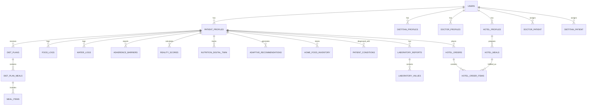

# NutriSphere — Entity-Relationship (ER) Diagram

```mermaid
erDiagram
    USERS ||--o{ PATIENT_PROFILES : has
    USERS ||--o{ DIETITIAN_PROFILES : has
    USERS ||--o{ DOCTOR_PROFILES : has
    USERS ||--o{ HOTEL_PROFILES : has

    USERS ||--o{ DOCTOR_PATIENT : assigns
    USERS ||--o{ DIETITIAN_PATIENT : assigns

    PATIENT_PROFILES ||--o{ DIET_PLANS : receives
    DIET_PLANS ||--o{ DIET_PLAN_MEALS : contains
    DIET_PLAN_MEALS ||--o{ MEAL_ITEMS : includes

    PATIENT_PROFILES ||--o{ FOOD_LOGS : logs
    PATIENT_PROFILES ||--o{ WATER_LOGS : logs
    PATIENT_PROFILES ||--o{ ADHERENCE_BARRIERS : reports

    PATIENT_PROFILES ||--o{ REALITY_SCORES : calculates
    PATIENT_PROFILES ||--o{ NUTRITION_DIGITAL_TWIN : tracks
    PATIENT_PROFILES ||--o{ ADAPTIVE_RECOMMENDATIONS : generates
    PATIENT_PROFILES ||--o{ HOME_FOOD_INVENTORY : stores

    PATIENT_PROFILES ||--o{ PATIENT_CONDITIONS : diagnosed_with
    PATIENT_PROFILES ||--o{ LABORATORY_REPORTS : has
    LABORATORY_REPORTS ||--o{ LABORATORY_VALUES : contains

    PATIENT_PROFILES ||--o{ HOTEL_ORDERS : places
    HOTEL_ORDERS ||--o{ HOTEL_ORDER_ITEMS : contains
    HOTEL_PROFILES ||--o{ HOTEL_MEALS : prepares
    HOTEL_MEALS ||--o{ HOTEL_ORDER_ITEMS : fulfilled_as
```
